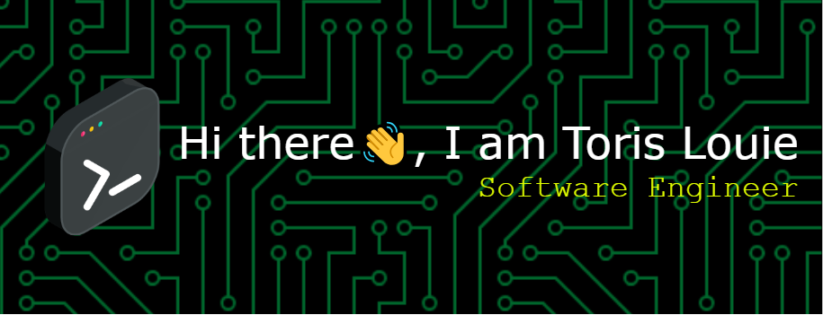

### 💫 LEAD DATA AND ANALYTICS ENGINEER
<b> Reporting / Information Solutions / Tools & Frameworks / Customer Service </b>
Dedicated professional showcasing 11+ years of achievements in data and analytics roles for industry-leading clients like Capgemini, Citibank, and UnitedHealth Group. Incorporates best practices to deliver outstanding analytics and data design, including managing data transformation efforts and facilitating large-scale technology projects. Delivers superb customer service while upholding strict attention to detail. Implements specialized tools and frameworks for automating report generation, enabling key business improvements and consistently exceeding expectations.

### 🌱 CAREER HIGHLIGHTS
- <b>Drove a reduction in work hours for Citibank</b>
  (via Rose International) after building out a cost optimization Excel report that analyzed over-provisioned, unused, and idle resources in Azure.
- <b>Enabled a significant boost in profits</b>
  after crafting engaging visualizations within Power BI, translating complex data into actionable insights.
- <b>Delivered valued aid in a cloud environment setup</b>
  with credentialing and authentication in mind at Capgemini (via MBO Partners), fostering clear and consistent team communication.
- <b>Overachieved on goals as a technical resource</b>
  for major projects involving systems integration, data visualizations, and reporting solutions.
- <b>Developed a well-received logical and physical database structure</b>
  to facilitate the analysis of data and increase the accuracy of related reporting/forecasting at Group One Automotive.
  
### ⚡ SKILLS & EXPERTISE 
Data Analysis / Reporting / Automation / Tool Implementations / Customer Service / Problem-Solving
Forecasts / Dashboards / Business Intelligence / Troubleshooting / New Technology / Scalable Solutions
Performance Improvement / Project Management / Data Models / Data Warehousing / Attention to Detail

### 📚 EDUCATION 
<b>University of Oklahoma:</b> Bachelor of Arts, Education
<b>Additional Education:</b> Databricks Certification, Power BI Certification, Pega Business Analyst Certification, Snowflake Certification, Ontology
### ⚙️ TECHNICAL SKILLS
Azure Synapse Analytics, Databricks, Jupyter Notebooks, Power BI, Microsoft SQL Server, Hadoop, Azure Cognitive Services, MySQL, Azure Data Factory, Cosmos DB, GitHub, Visual Studio, JIRA, BPMN, Visio, Excel, Airflow, DBT, SharePoint, Sriracha, JSON, PySparq, Python
### 🏆 HONORS & AWARDS
MBO Partners: MVP Award (x4), Collaboration Award (X2)
### 🌐 COMMUNITY ENGAGEMENT
New Era 8 Foundation / National MS Society

### 💻 Connect with me:
☎️ <b>(213) 810-6099 </b>
✉️ <b>TL2CMG@GMAIL.COM </b>
